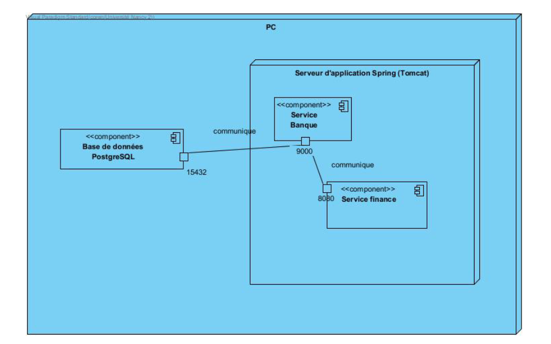
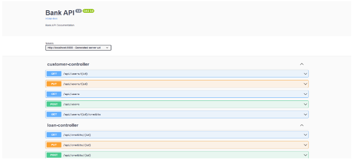

# Rapport API M2 SID - Bank API

Ce projet a été réalisé par SAINT-DIZIER Corentin, étudiant de la promotion 2023/2024 du Master 2 MIAGE SID.

Dans le cadre du cours de déploiement, passage à l'échelle et disponibilité, nous avions pour projet de développer une API RESTful pour un organisme bancaire afin de permettre la gestion de ses demandes de crédit. L'objectif était de mettre en pratique des liens métiers permettant de gérer la progression de la demande par le biais de HATEOAS (Hypermedia As The Engine of Application State), ainsi que de réaliser au minimum deux services pour démontrer l'échange entre 2 services distincts.

## Lancement de l'application

Pour pouvoir lancer l'application, il est tout d'abord nécessaire de démarré les outils nécessaires au bon fonctionnement de l'application. C'est à dire une base de données, dans notre cas ca sera une base de données PostgreSQL, ainsi que consul. Consul va nous permettre de découvrir les services au sein de notre applicaton.
Pour cela, un fichier `docker-compose.yml` est mis à disposition et prêt à l'emplois.

### Lancement des services
Pour lancer le docker-compose, il vous suffit de rentrer la commande `docker compose up` dans votre terminal favori.

### Démarrage du service "bank".

Tout d'abord, veuillez vous dirigez dans le dossier "bank-conseiller".

`cd bank-conseiller`

Pour démarrer le service "bank", il est tout d'abord recommander de compiler le code source et de créer un exécutable JAR.

`mvn clean package`

Ensuite pour démarrer l'application,il suffit d'éxéuter l'éxécutable JAR généré précedemment.

`java -jar target/bank-conseiller-0.0.1-SNAPSHOT.jar`

Votre service "bank" est désormais démarré.

### Démarrage du service "finance".

Tout d'abord, veuillez vous dirigez dans le dossier "bank-finance".

`cd bank-finance`

Pour démarrer le service "bank-finance", il est tout d'abord recommander de compiler le code source et de créer un exécutable JAR.

`mvn clean package`

Ensuite pour démarrer l'application,il suffit d'éxéuter l'éxécutable JAR généré précedemment.

`java -jar target/finance-service-0.0.1-SNAPSHOT.jar`

Votre service finance est désormais démarré.


## Qualité des réponses apportés aux besoin exprimés.

Voici une liste de *user stories* de mon API.

### Clients

- En tant que client, je veux **déposer une demande** de crédit afin de bénéficier de nouveaux moyens financiers
- En tant que client, je veux **modifier ma demande** de crédit tant qu'elle n'est pas envoyée afin d'y apporter ou de modifier des informations
- En tant que client, je veux **envoyer ma demande** de crédit afin qu'elle puisse être étudier.
- En tant que client, je veux **connaître** l'état de ma demande de crédit pour connaitre son avancement.
- En tant que client, je veux **voir** toutes mes demandes de crédits en cours pour connaitre leurs avancement. 
- En tant que client,  **je veux m'enregistrer** au sein de la banque afin de pouvoir y effectuer une demande de crédit
- En tant que client, je veux pouvoir voir en détails le changement de statut de ma demande de crédit.

### Conseiller

- En tant que conseiller, je veux **connaitre toutes les demandes** actuelles
- En tant que conseiller, je veux **connaitre** toutes les demandes.
- En tant que conseiller, je veux **connaitre** une demande en particulier.
- En tant que conseiller, je veux **accepter la demande** et la faire valider
- En tant que conseiller, je veux **refuser la demande** et la faire valider
- En tant que conseiller, je veux **vérifier auprès du service des finances publiques** la déclaration de revenus du demandeur
- En tant que conseiller, je veux pouvoir **voir les informations d'un demandeur de crédit**.

### Responsable

- En tant que responsable, je veux pouvoir **valider la décision du conseiller**.
- En tant que responsable, je veux pouvoir **refuser la décision du conseiller**.
- En tant que responsable, je veux pouvoir **avoir les mêmes rôles que le conseiller**.

## Conception HATEOAS

HATEOAS (Hypermédia as the Engine of Application State) est utilisé dans le cadre des applications RESTful pour permettre à l'utilisateur (au client) de naviguer de manière dynamique avec l'API.
L'avantage d'HATEOAS est de découplée l'application, permettant ainsi au client d'intéragir avec l'API sans voir une connaissance préalable de l'ensemble des enpoints.

Pour mettre en place une conception HATEOAS, nous avons utilisé principalement la classe et interface suivante : 

- L'interface `RepresentationModelAssembler<?,?>`, cette interface permet la création de représentations de ressources avec des liens hypermédias. Plus simplement, elle permet de transformé une entité JPA et de la transformer en une représentation de ressources enrichies de liens hypermédias.
- La classe `EntityModel` permet de faciliter la création de modèles de ressources RESTful dans l'application. Plus précisément, elle permet d'encapsuler les données d'une entité métier (une entité JPA dans notre cas). 

### Exemple de scénario

#### Création d'un client

*Endpoint : /api/users*

Corps de la requête :

```json
{
  "email": "john.doe@example.com",
  "firstName": "Doe",
  "lastName": "John",
  "birthDate": "1999-03-23",
  "adress": "123 Rue de l'Exemple",
  "job" : "Gamer"
}
```

Réponse : 

```json
{
    "customer_id": 1,
    "email": "john.doe@example.com",
    "firstName": "Doe",
    "lastName": "John",
    "birthDate": "1999-03-23",
    "adress": "123 Rue de l'Exemple",
    "job": "Gamer",
    "_links": {
        "self": [
            {
                "href": "http://localhost:9000/api/users/1",
                "type": "PUT"
            },
            {
                "href": "http://localhost:9000/api/users/1",
                "type": "GET"
            }
        ],
        "users": {
            "href": "http://localhost:9000/api/users",
            "type": "GET"
        },
        "credits": {
            "href": "http://localhost:9000/api/users/1/credits",
            "type": "GET"
        }
    }
}
```

#### Création d'une demande de crédit

*Endpoint : /api/credits*

Corps de la requête : 

```json
{
  "loanAmount": 40000.0,
  "loanDuration": 36,
  "revenue3dernierreAnnee": 50000.0,
  "loanType": "CONSOMMATION",
  "customer" : {
    "customer_id" : 1
  }
}
```

Réponse : 201 (created).

```json
{
    "id": 1,
    "loanAmount": 40000.0,
    "loanDuration": 36,
    "revenue3dernierreAnnee": 50000.0,
    "status": "DEBUT",
    "proposalAdvisor": "DEBUT",
    "loanType": "CONSOMMATION",
    "lastModified": "2024-03-15",
    "requestDate": "2024-03-15",
    "customer": {
        "customer_id": 1,
        "email": "john.doe@example.com",
        "firstName": "Doe",
        "lastName": "John",
        "birthDate": "1999-03-23",
        "adress": "123 Rue de l'Exemple",
        "job": "Gamer"
    },
    "_links": {
        "self": [
            {
                "href": "http://localhost:9000/api/credits/1",
                "type": "PUT"
            },
            {
                "href": "http://localhost:9000/api/credits/1",
                "type": "POST"
            },
            {
                "href": "http://localhost:9000/api/credits/1/details",
                "type": "GET"
            }
        ],
        "list": [
            {
                "href": "http://localhost:9000/api/credits",
                "type": "GET"
            },
            {
                "href": "http://localhost:9000/api/credits/pending",
                "type": "GET"
            }
        ],
        "customer": {
            "href": "http://localhost:9000/api/users/1",
            "type": "GET"
        }
    }
}
```

Une fois la demande créer, elle est a l'état "DEBUT", elle peut donc encore être modifié ou envoyer pour étude. Nous allons l'envoyer pour étude.

#### Etude de la demande

*Endpoint : /api/crédit/{id}*

Réponse :

```json
{
    "id": 1,
    "loanAmount": 40000.0,
    "loanDuration": 36,
    "revenue3dernierreAnnee": 50000.0,
    "status": "ETUDE",
    "proposalAdvisor": "ETUDE",
    "loanType": "CONSOMMATION",
    "lastModified": "2024-03-15",
    "requestDate": "2024-03-15",
    "customer": {
        "customer_id": 1,
        "email": "john.doe@example.com",
        "firstName": "Doe",
        "lastName": "John",
        "birthDate": "1999-03-23",
        "adress": "123 Rue de l'Exemple",
        "job": "Gamer"
    },
    "_links": {
        "self": [
            {
                "href": "http://localhost:9000/api/credits/1/accept",
                "type": "POST"
            },
            {
                "href": "http://localhost:9000/api/credits/1/refuse",
                "type": "POST"
            },
            {
                "href": "http://localhost:9000/api/credits/1/validate",
                "type": "GET"
            },
            {
                "href": "http://localhost:9000/api/credits/1/details",
                "type": "GET"
            }
        ],
        "list": [
            {
                "href": "http://localhost:9000/api/credits",
                "type": "GET"
            },
            {
                "href": "http://localhost:9000/api/credits/pending",
                "type": "GET"
            }
        ],
        "customer": {
            "href": "http://localhost:9000/api/users/1",
            "type": "GET"
        }
    }
}
```

Une fois que la demande passe à l'état "ETUDE", le conseiller à le choix : 
- D'accepter la demande
- De refuser la demande
- De l'envoyer pour vérification au service des finances

Le conseiller décide d'accepter la demande.

#### Acceptation de la demande par le conseiller

*Endpoint : /api/credits/1/accept *

Réponse :

```json
{
    "id": 1,
    "loanAmount": 40000.0,
    "loanDuration": 36,
    "revenue3dernierreAnnee": 50000.0,
    "status": "VALIDATION",
    "proposalAdvisor": "ACCEPTATION",
    "loanType": "CONSOMMATION",
    "lastModified": "2024-03-15",
    "requestDate": "2024-03-15",
    "customer": {
        "customer_id": 1,
        "email": "john.doe@example.com",
        "firstName": "Doe",
        "lastName": "John",
        "birthDate": "1999-03-23",
        "adress": "123 Rue de l'Exemple",
        "job": "Gamer"
    },
    "_links": {
        "self": [
            {
                "href": "http://localhost:9000/api/credits/1/valid",
                "type": "POST"
            },
            {
                "href": "http://localhost:9000/api/credits/1/reject",
                "type": "POST"
            },
            {
                "href": "http://localhost:9000/api/credits/1/details",
                "type": "GET"
            }
        ],
        "list": [
            {
                "href": "http://localhost:9000/api/credits",
                "type": "GET"
            },
            {
                "href": "http://localhost:9000/api/credits/pending",
                "type": "GET"
            }
        ],
        "customer": {
            "href": "http://localhost:9000/api/users/1",
            "type": "GET"
        }
    }
}
```

On observe la demande passe à l'état "VALIDATION", ce qui signifie que la demande doit être validé (ou refusé) par le responsable.

Le responsable décide d'approuver la demande de crédit.

#### Validation de la demande de crédit par le responsable

*Endpoint : /api/credits/1/valid*

Réponse : 

```json
{
    "id": 1,
    "loanStartDate": "2024-03-15",
    "loanEndDate": "2027-03-15",
    "creditDeadlineAmount": 2400.0000000280593,
    "capitalAmount": 40000.0,
    "rateLoan": 6.0,
    "_links": {
        "creditsPending": {
            "href": "http://localhost:9000/api/credits/pending",
            "type": "GET"
        }
    }
}
```

Enfin, une fois la demande de crédit validé, les échéances de crédits sont instanciées et sont caractérisé par : 
- La date de début du crédit
- La date de fin
- Le montant par mois
- Le capital demandé par le client
- Le taux de crédit

*Remarque :* Pour choisir un taux de crédit, j'ai décidé d'ajouter un type de crédit lors de l'envoie de la demande (Consommation, Immobilier, Automobile etc.). Alors, lors de la création des échéances de crédits, je décide d'attribuer un taux en fonction du type de crédit comme le montre le code suivant : 

```java
   public static final HashMap<CreditType, Double> rates = new HashMap<CreditType, Double>() {
        {
            put(CreditType.CONSOMMATION, 6.00);
            put(CreditType.IMMOBILIER, 3.00);
            put(CreditType.AUTOMOBILE, 5.00);
            put(CreditType.PERSONNEL, 7.00);
            put(CreditType.TRAVAUX, 5.00);
            put(CreditType.PRO, 8.00);
        }
    };
```

## Réalisation technique

Au sein de l'API, nous avons 2 services, celui de la banque et celui des finances publiques.

Voici un schéma représentant leurs communication.



#### Couche de persistance

Concernant la réalisation technique, j'ai tout d'abord décidé d'avoir 4 entités au sein de mon API : 

1) Une entité pour représenter les demandes de crédit.
2) Une entité pour représenter les clients.
3) Une entité pour représenter les échéances de crédits.
4) Une entité permettant de représenter le détails des changements d'état des demandes de crédits

Ensuite, au sein de mon API, la couche de persistance est gérer par JPA (Java Persistence API). JPA m'a permis de pouvoir mapper mes entités Java (Spring) à des entités de base de données relationnelles (PostgreSQL).

#### Couche métier.

Au niveau de la couche métier, pour la séparation des responsabilités, j'ai décidé de créer 3 interfaces qui auront chacune leurs implémentation.

1) Une classe service permettant de gérer la logique métier des demandes de crédits
2) Une classe service permettant de gérer la logique métier des clients
3) Une classe service permettant de gérer la logique métiers des échéances de crédits.

#### Couche RESTful

Concernant la couche RESTful, pour respecter les choix cités précédemment, nous avons 3 classes qui expose leurs différents points d'accès 'endpoints' à travers lesquels les utilisateur de l'API peuvent interagir avec l'application.

Pour pouvoir voir plus en détails ces routes RESTful, une documentation Swagger est mis à disposition à cette URL accessible lorsque le service banque est démarrer.

URL : http://localhost:9000/swagger-ui/index.html#/
*Attention : il est nécessaire de devoir démarrer l'application pour pouvoir accéder à la documentation*.



### Aspects techniques

#### Communication entre le service banque et le service des finances

Pour que nos deux services puissent communiquer, j'ai décidé de mettre en place un circuit breaker qui va se charger de faire appel au service des finances. Si ce dernier échoue à répondre, le circuit breaker va basculer à l'état "ouvert", ce qui va empêcher l'envoie de requête inutile à un service défaillant.

Au sein de ma classe `LoanController.java`, nous pouvons y voir un endpoint `/{id}/validate` avec une méthode GET, pour demander au service des finances si les revenus déclarés par le client sont bien corrects.

Voici le code de cette méthode.

```java
 @GetMapping("/{id}/validate")
    @CircuitBreaker(name = "bank-service", fallbackMethod = "fallbackValidationCall")
    @Retry(name = "bank-service")
    public ResponseEntity<EntityModel<Loan>> getValidationLoanByFinanceService(@PathVariable(value = "id") long loanId) {
        Loan loanFind = loanRepository.findById(loanId).orElseThrow();
        if (!loanRepository.findById(loanId).isPresent()) {
            return ResponseEntity.notFound().build();
        }
        RoundRobinLoadBalancer lb = clientFactory.getInstance("finance-service", RoundRobinLoadBalancer.class);
        ServiceInstance instance = lb.choose().block().getServer();
        String url = "http://" + instance.getHost() + ":" + instance.getPort() + "/{id}/validate?amount="+ loanFind.getRevenue3dernierreAnnee();
        String response = template.getForObject(url, String.class, loanId);
        switch (response) {
            case "ok":
                loanFind.setStatus(StatusEnum.VALIDATION);
                loanRepository.save(loanFind);
                break;
            case "ko":
                loanFind.setStatus(StatusEnum.REJET);
                loanRepository.save(loanFind);
                break;
            default:
                break;
        }
        loanFind.setLastModified(this.getCurrentDate("yyyy-MM-dd"));
        return ResponseEntity.ok(loanModelAssembler.toModel(loanFind));
    }
```

Lors de l'appel à cet endpoint, le code va donc se charger de faire plusieurs choses : 
- Créer une instance de la classe `RoundRobinBalancer` 
- De récupérer une instance du service "finance-service"
- De créer une URL sur laquelle la requête va être lancé
- Le traitement de la réponse obtenue par le service des finances

Dans le cas ou le service des finances et défaillant, notre service va se charger d'exécuter le contenu de la méthode `fallbackValidationCall`. Voici son contenu.

```java
    public ResponseEntity<EntityModel<Loan>> fallbackValidationCall(long loanId, Throwable t) {
        System.out.println("Fallback method called");
        Loan creditRequest = loanRepository.findById(loanId).orElseThrow();
        return ResponseEntity.status(503).body(loanModelAssembler.toModel(creditRequest));
    }
```

Cette méthode est simple, elle va se charger uniquement de retourner la demande de crédit qui a été envoyé au service des finances et renvoyé un code d'erreur 503 (`ServiceUnavailable`).